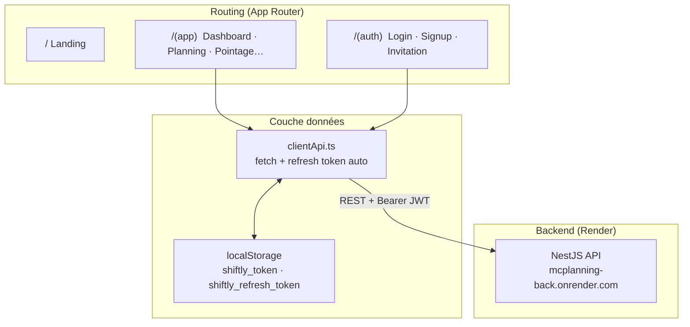
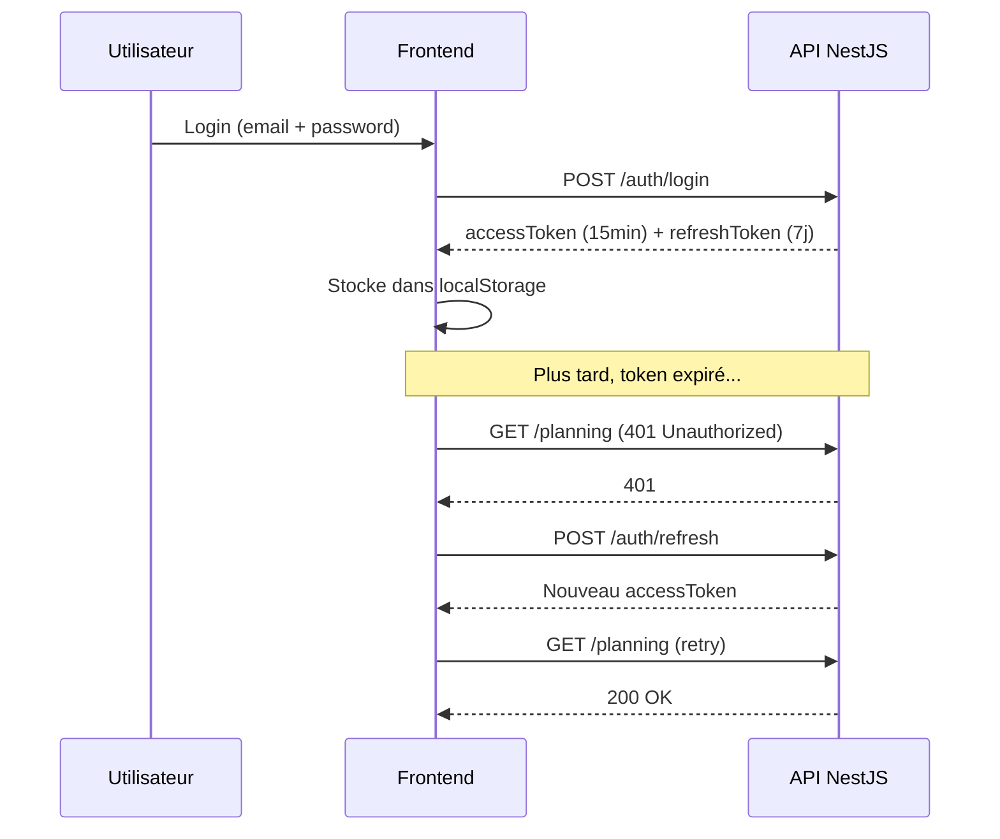

# 🎨 Shiftly — Frontend

[](https://nextjs.org/)
[](https://www.typescriptlang.org/)
[](https://tailwindcss.com/)
[](https://shiftly.site)

Interface web de **Shiftly**, l'application SaaS de gestion de planning et de présences d'équipe.

> 👤 **Développeur :** [Sayeh Ahmed](https://www.sayehahmed.com)  
> 🌐 **Production :** [shiftly.site](https://shiftly.site)  
> 🔗 **Repo backend :** [Mc-planning-back](https://github.com/ahmvdd/Mc-planning-back)

---

## 🏗️ Architecture Frontend



---

## 📦 Stack technique

| Librairie | Usage |
|-----------|-------|
| **Next.js 16** App Router | Routing, SSR, layouts imbriqués |
| **Tailwind CSS v4** | Styles — palette zinc dark |
| **Framer Motion** | Animations de page et composants |
| **Lenis** | Scroll fluide |
| **lucide-react** | Icônes |
| **html5-qrcode** | Scan QR code via caméra |
| **xlsx** | Lecture et export de fichiers Excel |

---

## 🗂️ Structure des pages

```
src/app/
│
├── page.tsx                    # 🏠 Landing page (publique)
├── cgu / confidentialite / rgpd / support
│
├── (auth)/                     # Pages non-protégées
│   ├── login/                  # Connexion
│   ├── signup/admin/           # Création compte admin + organisation
│   ├── signup/employee/        # Inscription employé
│   └── invitation/[token]/     # Acceptation d'une invitation
│
└── (app)/                      # Pages protégées — JWT requis
    ├── layout.tsx               # Navbar + footer (dark)
    ├── dashboard/               # Vue d'ensemble, planning du jour
    ├── planning/                # Créneaux, import Excel, planning visuel S1/S2
    ├── employees/               # Liste des employés (admin) · profil (employé)
    ├── requests/                # Demandes RH — congés, documents
    ├── pointage/                # Présences du jour + QR d'entrée (admin)
    ├── scan/                    # Scan QR code pour pointer l'arrivée
    ├── profile/                 # Profil personnel + changement de mot de passe
    └── admin/                   # Paramètres organisation (admin)
```

---

## 🔑 Authentification



> Toute la logique de refresh est encapsulée dans `src/lib/clientApi.ts`. Les pages n'ont pas à la gérer.

---

## 👥 Rôles et accès

| Page | Admin | Employé |
|------|:-----:|:-------:|
| `/dashboard` | ✅ | ✅ |
| `/planning` | ✅ édition | ✅ lecture |
| `/employees` | ✅ | ❌ |
| `/requests` | ✅ valider | ✅ créer |
| `/pointage` | ✅ | ❌ |
| `/scan` | ✅ | ✅ |
| `/profile` | ✅ | ✅ |
| `/admin` | ✅ | ❌ |

---

## 📋 Fonctionnalités clés

### Planning visuel
- Upload d'une image (photo du planning papier) ou d'un fichier **Excel/CSV**
- Deux slots : Semaine 1 et Semaine 2
- Détection automatique de la ligne de l'employé connecté dans le tableau Excel
- Import en base de données → les employés peuvent pointer via QR

### Pointage QR
- L'admin génère un **QR code d'entrée permanent** (`/pointage`)
- L'employé scanne depuis `/scan` → pointage automatique avec statut : `present` / `late` / `absent`
- Calcul basé sur l'heure réelle du shift (`08h-16h`, `8h30 – 16h`, etc.)
- Pointage manuel possible par l'admin

### Invitations employés
1. Admin envoie une invitation depuis `/admin`
2. L'employé reçoit un email → clique le lien `/invitation/[token]`
3. Il complète son profil → compte créé, redirect `/login`

---

## ⚙️ Démarrage local

**Prérequis :** Node.js 20+ — backend lancé sur le port `3001`

```bash
# 1. Installer les dépendances
npm install

# 2. Lancer le serveur de développement
npm run dev
# → http://localhost:3000
```

`.env.local` déjà configuré :

```env
NEXT_PUBLIC_API_BASE=http://localhost:3001/api
```

> **Sur Vercel :** `NEXT_PUBLIC_API_BASE=https://mcplanning-back.onrender.com/api`

---

## 🧩 Composants

| Fichier | Rôle |
|---------|------|
| `navbar.tsx` | Navigation responsive avec menu mobile |
| `org-title.tsx` | Nom de l'organisation affiché en header |
| `auth-quote.tsx` | Citation décorative sur les pages d'auth |
| `smooth-scroll.tsx` | Provider Lenis pour le scroll fluide |
| `split-text.tsx` | Animation texte lettre par lettre (Framer Motion) |

---

## 📜 Scripts

```bash
npm run dev      # Serveur dev avec Turbopack
npm run build    # Build de production
npm run start    # Serveur de production
npm run lint     # ESLint
```

---

## 🌿 Branches

| Branche | Rôle |
|---------|------|
| `main` | Production — déployé automatiquement sur Vercel |
| `develop` | Intégration — branche de travail principale |
| `feat/xxx` | Nouvelles fonctionnalités |

**Workflow :** `feat/xxx` → PR vers `develop` → PR vers `main`
